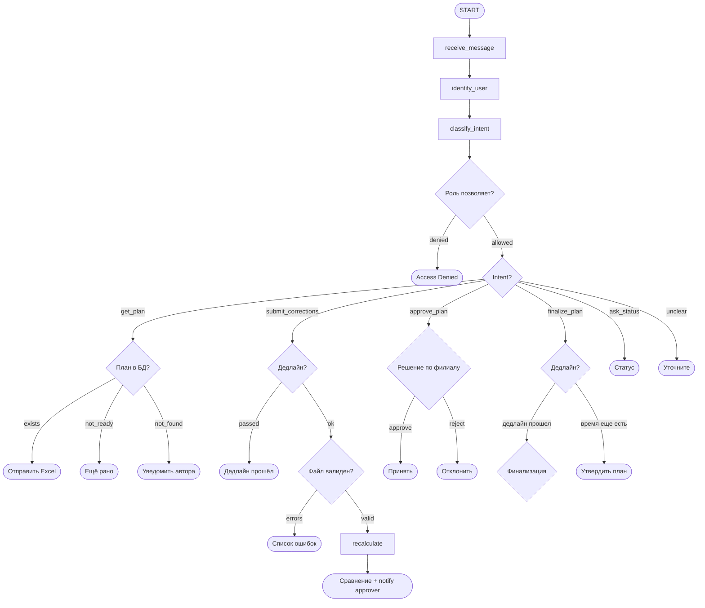

# 📊 Ad Placement Planning Agent

AI-агент для автоматизации процесса корректировок ежемесячного плана размещения рекламы домашнего интернета.

## Задача

Автоматизировать взаимодействие между ответственными сотрудниками (editors) и руководителем (approver) в процессе подготовки плана рекламного размещения:
- Выгрузка плана по запросу
- Приём и валидация корректировок
- Пересчёт прогноза заявок
- Формирование сравнительного анализа
- Финализация плана

## Архитектура

Conversational AI-агент на базе LangGraph с ролевой моделью доступа.

### Пользователи

| Роль | Возможности |
|------|-------------|
| Editor | Запрос плана, отправка корректировок, просмотр статуса |
| Approver | Всё вышеперечисленное + утверждение/отклонение корректировок + финализация плана |

### Tools

| Tool | Внешняя система | Назначение |
|------|-----------------|------------|
| `query_plan_db` | PostgreSQL | Запрос данных плана |
| `export_plan_to_excel` | Файловая система | Формирование .xlsx |
| `validate_corrections_file` | PostgreSQL + файл | Валидация корректировок |
| `run_forecast_model` | Python (mock) | Пересчёт прогноза |
| `send_notification` | Мессенджер (mock) | Уведомления |
| `get_deadline_info` | PostgreSQL | Проверка дедлайнов |
| `save_final_plan` | PostgreSQL | Сохранение итогового плана |

### Блок-схема графа



## Быстрый старт

### Предварительные требования
- Docker и Docker Compose
- Выбор LLM/API ключи (см. `.env.example`)

### Запуск

```bash
# 1. Клонировать репозиторий
git clone https://github.com/WhatSoNot7/ad-placement-agent.git
cd ad-placement-agent

# 2. Создать .env файл
cp .env.example .env
# Заполнить переменные окружения (см. ниже)

# 3. Запустить
docker-compose up --build

# 4. Агент доступен по адресу:
http://localhost:8501 (UI, если есть Streamlit)
```


### Чек-лист реализации

| Требование | Статус |
|-----------|--------|
| AI-агент на LangGraph | ✅ Реализовано |
| Нелинейный граф (≥2 точки ветвления) | ✅ Реализовано |
| RAG | ⬜ Реализовано / ✅ Не применимо |
| Минимум 3 tool | ✅ Реализовано |
| Взаимодействие с внешней системой | ✅ Реализовано |
| Benchmark (10 запросов) | ✅ Реализовано |
| LangFuse трейсы | ✅ Реализовано (cloud) |
| Eval-кейсы (3 типа) | ⬜ Планируется |
| Security checklist | ⬜ Планируется |
| Docker Compose | ✅ Реализовано |
| Structured Output (Pydantic) | ✅ Реализовано |
| Graceful degradation при ошибках | ✅ Реализовано |
| Email-уведомления разработчику | ✅ Реализовано |